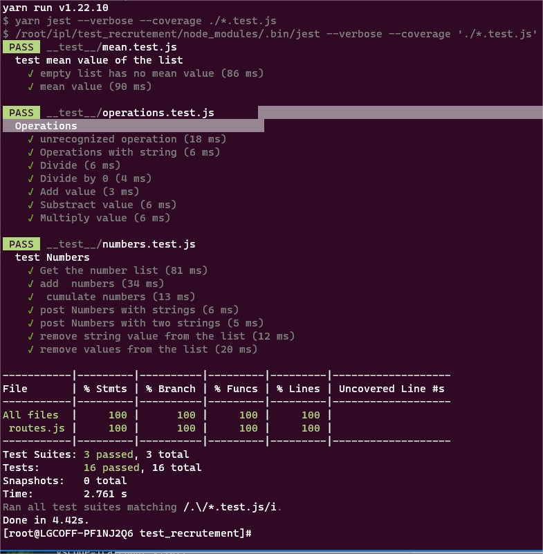

# ip-Label recruitment test #

The subject of this test is to build an node.js/express REST API witch store a list of numbers and allow some manipulations on it.


A swagger file and ui is provided in the project : you can display and use it by launching the application:
 ```bash
 yarn install # install the project
 yarn serve # the swagger UI is browsable on http://localhost:3001
 ```


To launch the unit tests suites:
 ```bash
 yarn test
 ```
 It will executes all the tests files in the ``__test__`` folders not marked as ``skip``
 ### project tree : ###
__test_recrutement__  
├── index.js  
├── jest.config.js  
├── junit.xml  
├── package.json  
├── README.md  
├── routes.js  
├── swaggerdoc.yaml  
├── __test__  
│   ├── mean.test_skip.js  
│   ├── numbers.test.js  
│   └── operations.test_skip.js  
└── yarn.lock  
___
## The codding test steps: ##

### 1. The Numbers routes ####

💡All the Unit tests in the ``__test__/numbers.test.js `` must pass
### 2. The Numbers/{operation} route  ### 
Rename the ``__test__/operations.test_skip.js `` to `` __test__/operations.test.js ``  
💡 All Unit tests must pass

### 3. The Mean value calculation ### 
Rename the ``__test__/operations.test_skip.js `` to `` __test__/operations.test.js ``  
💡 All Unit tests must pass 


___
__Your goal is have this result:__
    



We will pay equal attention to the quality and the readability of your code.   
Feel free to leave comments to explain you choices
Good luck
 
 
